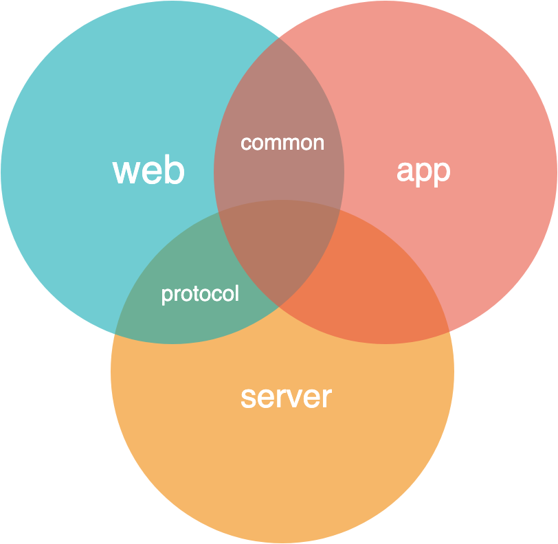
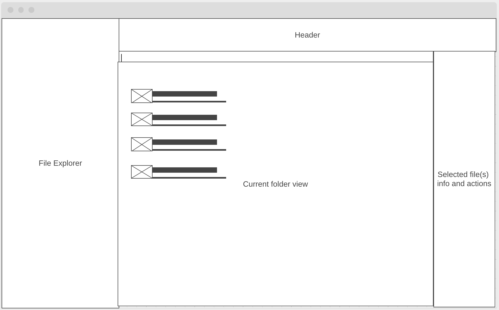
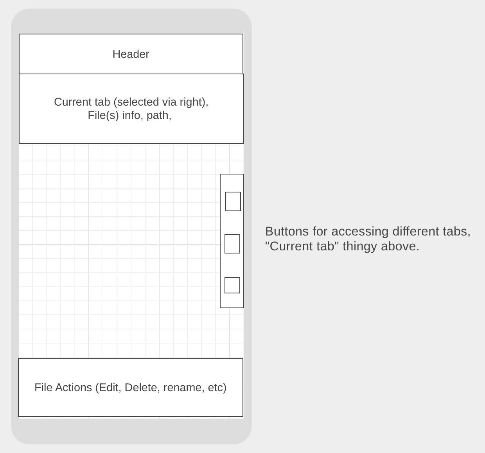

# ftp-client
FTP Client that can be used as a WebFTP (and as an electron app).

**Note:** The electron app does not exist yet.

## Features
- Editing text files
- Viewing images
- Drag and drop uploading
- Folder uploading
- Folder downloading as zip
- Mobile friendly
- Caching for fast folder navigation
- Calculate the size of folders
- Viewing gzipped files
- Viewing Minecraft NBT files

# Technical information

## Folder structure

`src/common` - common code included both on the website and electron app.

`src/protocol` - common code for the server and website, mostly related to the protocol used for the websocket connection.

`src/web` - code only availiable on the website.

`src/server` - source for the server.

**Note:** The electron app does not exist yet.

## Build folder

`build/website-dev` - Folder where the website is when in development, uses ESM (`type="module"` scripts).

`build/website-dist` - Bundled website

`build/server` - NodeJS server code, run with `node build/server/server/src/index.js`

## Wireframes
Desktop

Mobile

## Features & TODO
- [x] Context menu
- [x] Editor base
- [x] Previewing images
- [x] Previewing text (maybe, or just editing - text)
- [x] Editing text
- [x] Folder Entry selecting
- [x] Choose how to open file with unknown file extention (as text, or image, maybe a hex viewer?)
- [x] File uploading (protocol)
- [x] Drag and drop file uploading
- [x] File uploading via file input
- [x] Upload button choose file or folder
- [x] Folder uploading (fun!)
- [x] Zip uploading, jszip
- [x] Folder downloading as zip, jszip
- [x] Compute size of folder
- [x] Left sidebar
- [x] Right sidebar
- [ ] Editable Path
- [x] Cache
- [ ] Electron app
- [x] Work on mobile
- [x] File deleting
- [x] File renameing
- [x] mkdir
- [x] Reconnecting
- [x] Folder deleting
- [x] Viewing gzipped files
- [ ] Current Open Editors window on the bottom right.
- [x] Nicer dialogs
- [x] Prevent saving gzipped files.
- [ ] Nbt reading and writing
    - [ ] Nbt editing
    - [ ] Nbt writing
    - [ ] Copying nbt as snbt and binary nbt in the editor
    - [ ] Reading region files

## Protocol spec

The website can't send FTP requests on it's own and requires a websocket server to handle the requests for it. This sections describes the protocol used for communication between the website and the websocket server.

Most of the time the website (client) sends requests to the server, in which the server replies.

Packets currently use JSON. The data and response must be a json object, and may not be an array for example. The packet id is placed in the `packetId` property. The client can also include a `requestId` property, and if that is done the server will send a reply in which the json contains the same `requestId` property. Some packets need to contain binary data, for example file upload and downloads. In these cases the data should be encoded as a base64 string.